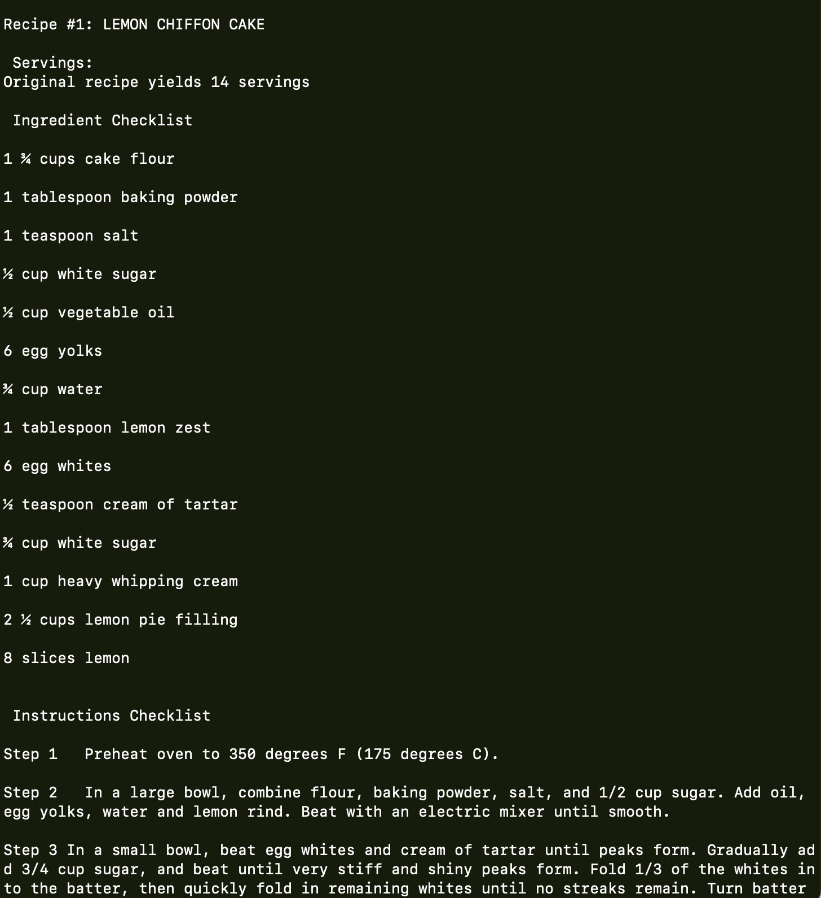

# **Luna's Kitchen**

<p align="center">
  
</p>

## **Summary**
*Luna's Kitchen* is a terminal-based recipe generator Python program that uses the requests and BeautifulSoup4 modules to webscrape data from [Allrecipes](https://www.allrecipes.com/) to populate a recipe title, recipe description summary, link to recipe URL, and recipe details including serving size, ingredients list, and instructions list. 

Users have the ability to read and write a recipe and the recipe ingredients to a "my recipes list" and "shopping list" .txt files. 

## **Tech Stack**
Backend: Python<br/>
Libraries: [Requests](https://pypi.org/project/requests/), [BeautifulSoup4](https://pypi.org/project/beautifulsoup4/)

## **Features**
### **Search for Recipes**
<br>

### **View Results**
<br>

### **View Recipe**
<br>

### **Save Recipe and Save Recipe Ingredients**
<br>

### **View All Saved Recipes**
<br>

### **Display Shopping List by Recipe**
<br>


## **Installation**
To run *Luna's Kitchen*:

Clone or fork the [repository](https://github.com/lunaxlam/lunaskitchen.git)

```
https://github.com/lunaxlam/lunaskitchen.git
```

In the project directory, create and activate a virtual environment:

```
virtualenv env
source env/bin/activate
```

Install the project dependencies:
```
pip3 install -r requirements.txt
```

Run the application:

```
python3 lunaskitchen.py
```

You can now access *Luna's Kitchen*! Happy cooking.